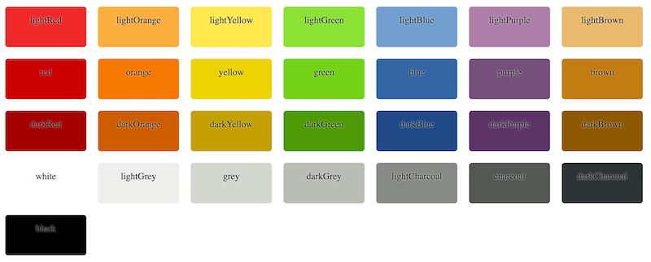

[](https://travis-ci.org/avh4/elm-color)

# elm-color

The this package defines a standard `Color` type
(taking the place of `elm-lang/core#Color` in Elm 0.18)
with the hope that all Elm packages that produce colors and
all Elm packages that consume colors will use this type
to allow all such packages to easily interoperate
for the ultimate benefit of all Elm developers.
(If you are a package author and find that the `Color` type here does not meet your package's
needs for passing colors to or from your package,
please [report an issue](https://github.com/avh4/elm-color/issues/new) so we can improve this package to support your needs.)

Future versions of this package will include additional common conversions
and color manipulation functions.
If you have used other color packages or written your own color-related functions in the past,
please [create an issue](https://github.com/avh4/elm-color/issues/new) to describe your use case
so we can better design additions to this package.


## Example

```elm
import Color exposing (Color)
import Html exposing (Html)
import Html.Attributes exposing (style)

view : Color -> Html msg
view foreground =
    let
        hue =
            (Color.toHsla foreground).hue

        borderColor =
            Color.hsla hue 0.75 0.5 0.8
    in
    Html.div
        [ style "background-color" (Color.toCssString Color.lightOrange)
        , style "color" (Color.toCssString foreground)
        , style "border-color" (Color.toCssString borderColor)
        ]
        [ Html.text "(ᵔᴥᵔ)" ]
```


## Built-in colors

This package also provides an "aesthetically reasonable" set of common colors.




## Roadmap

- [x] Initial release: defines color type and basic conversion functions
- [ ] 1.1.0: implement common color manipulation functions
